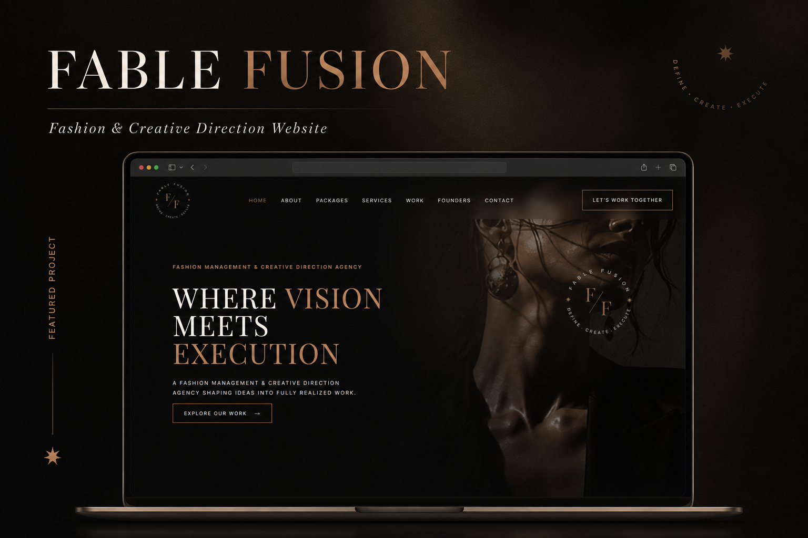
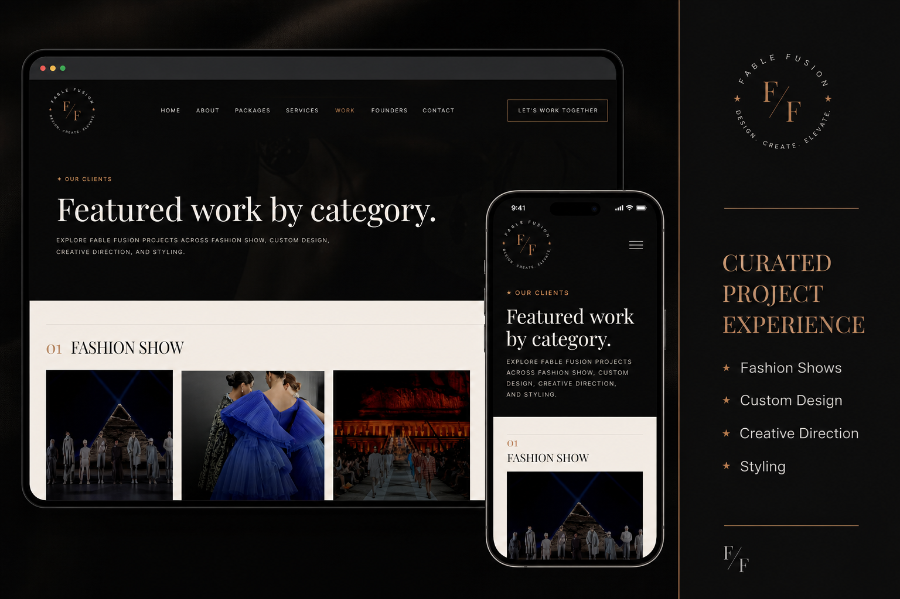
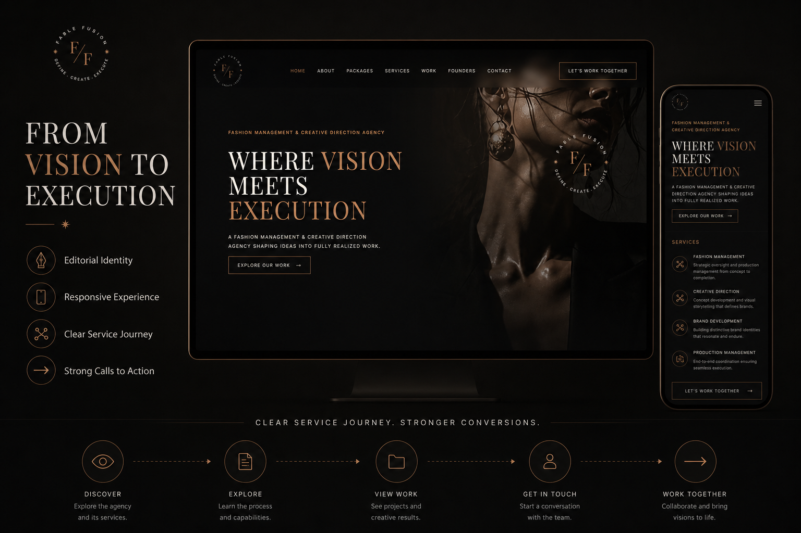
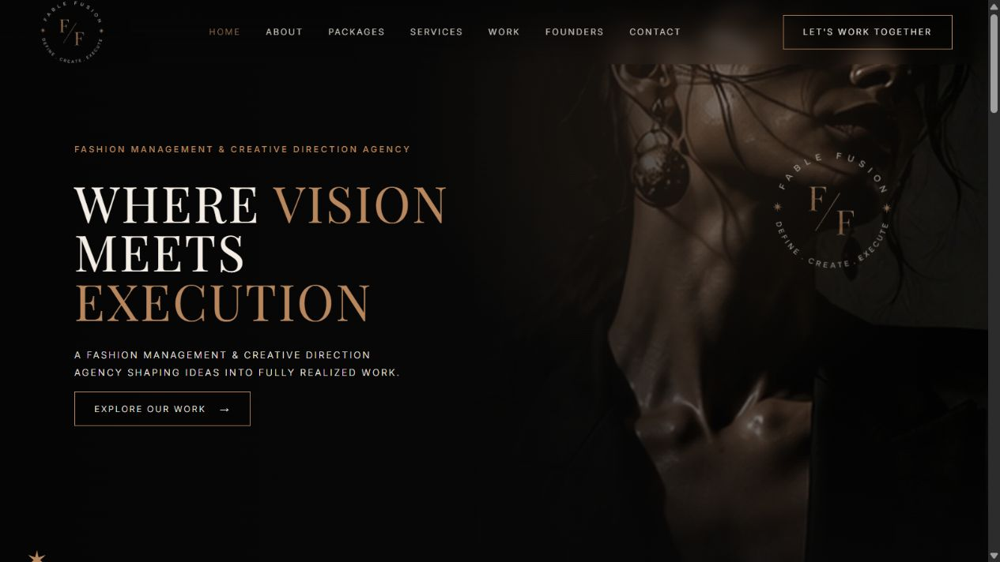

# Fable Fusion Fashion & Creative Direction Website

> A premium responsive web experience translating a fashion brand's editorial identity into compelling services and project storytelling.

## Project overview

Fable Fusion needed more than a standard company website. The experience balances luxury visual direction with clear business communication, presenting the founders, services, packages and portfolio without losing the brand's distinctive character.

**My role:** Web Developer, UI Implementation and QA  
**Delivery:** Content structure, responsive implementation, interactions, testing and deployment

## Experience delivered

- Luxury editorial presentation aligned with the fashion industry
- Structured service and package communication
- Founder and brand storytelling
- Project portfolio for fashion shows, styling, custom design and creative direction
- Dedicated project pages and strong calls to action
- Responsive layouts across desktop, tablet and mobile
- Contact paths designed to turn interest into enquiries

## Project storytelling

## Responsive experience

## Live brand presentation

## Quality and delivery

- Detailed visual and interaction checks
- Responsive testing across major breakpoints
- Content hierarchy and readability review
- Link, form and navigation validation
- Production deployment and launch verification

## Privacy and source code

This repository is a **visual case study**. The production source code and private business material are not published. Brand assets remain the property of their respective owner.

## Need a high-end business website?

I can turn a client's goals and content into the requirements, design direction, implementation, testing, content upload and deployment needed for a polished, ready-to-launch website.
